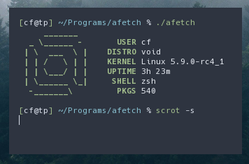
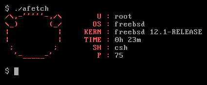

# aFetch ~ Another Fetch
Simple system info written in C
Can be configured at compile time by editing the [config.h file](config.h) 

**Requirments**
*  A /etc/os-release file (/var/run/os-release on BSDs also works)
*  A C compiler
*  libsysinfo if on FreeBSD

**Currently Supports**
*  Void
*  Gentoo
*  Arch
*  Artix
*  Fedora (slow due to the package manager)
*  Debian

**Partial Support**
*  FreeBSD (Should be fully supported, but there are linking errors)

**Please request your distro if you want it added**

(I don't use FreeBSD, but the screenshot above should look similar)

**To do**
*  Add support for more distros (please request your distro, and provide the content of the /etc/os-release file)
*  Fix strncmp function deleting needed characters (this will help make the program more efficient, with less if statements.

**Thanks**
*  [neofetch](https://github.com/dylanaraps/neofetch)

