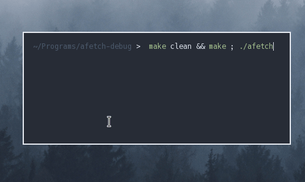

<h2 align="center"> afetch </h2>

<h3 align="center">  </h3>

Fast and simple system info (for UNIX based operating systems) written in C99, that can be configured at compile time by editing the <a href="https://raw.githubusercontent.com/13-CF/afetch/master/config.h"> config.h</a> file.    
afetch is a command line tool to display basic system information. The goal is to be highly configurable, extremely fast and work with minimal dependencies. 

**Requirments**
*  A /etc/os-release file 
*  A C compiler
*  A compatible C standard library implementation

**Currently Supports**

*  Void
*  Gentoo
*  Arch
*  Artix
*  Fedora (slow due to package manager)
*  OpenSUSE Leap (slow due to package manager)
*  OpenSUSE Tumbleweed (slow due to package manager)
*  Debian
*  Ubuntu
*  Manjaro
*  Alpine
*  FreeBSD 
*  OpenBSD 
*  NetBSD
*  DragonflyBSD
*  Slackware
*  Pop!_OS

If your OS isn't in the list above, you'll still be able to build the program as long as you're either using Linux, or another UNIX based operating system with the necessary header files.

**Please request your distro if you want it added**

If on Linux, please show me the contents of the `/etc/os-release` file. 

**Manual**

I have provided a manual for configuration in the [afetch.1](afetch.1) file. You can view it by running `mandoc afetch.1 | less`, or `man afetch` if you've already ran `make install`.

**Configuration options**
*  Custom colours
*  Custom artwork
*  Edit headings for info rows 
*  Force lowercase text (unstable)
*  Show path to shell
*  Select text colour
*  Colour blocks

**To do**
*  Fix segfaults on certain distros when lowercase text is enabled, maybe a memory error?
*  Improve the OS function
*  Improve Makefile

**Thanks**
*  [neofetch](https://github.com/dylanaraps/neofetch)
*  [ufetch](https://github.com/jschx/ufetch)
*  [nerdfetch](https://github.com/ThatOneCalculator/NerdFetch)
*  [bitfetch](https://gitlab.com/bit9tream/bitfetch)
