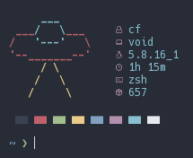

# afetch

<h3 align="center"> </h3>

Fast and simple system info written in C, that can be configured at compile time by editing the [config.h](config.h) file. 

afetch is a command line tool to display basic system information. The goal is to be highly configurable, extremely fast and work with minimal dependencies. 

**Requirments**
*  A /etc/os-release file (/var/run/os-release works, or freebsd-version command)
*  A C compiler (preferably GCC, I can't get it to compile with clang on FreeBSD)
*  libsysinfo if on FreeBSD

**Currently Supports**
*  Void
*  Gentoo
*  Arch
*  Artix
*  Fedora (slow due to package manager)
*  OpenSUSE Leap (slow due to package manager)
*  OpenSUSE Tumbleweed (slow due to package manager)
*  Debian
*  Ubuntu
*  Manjaro
*  Alpine
*  FreeBSD (Makefile must be edited to include libsysinfo)
*  Slackware

**Building on FreeBSD**
*  You will have to install the libsysinfo package, then follow the instructions in the Makefile

**| Please request your distro if you want it added**

**Configuration options**
*  Custom colours
*  Custom artwork
*  Edit headings for info rows 
*  Force lowercase text (unstable)
*  Show path to shell
*  Select text colour

**To do**
*  Fix segfaults on certain distros when lowercase text is enabled, maybe a memory error?
*  Improve Makefile
*  Clean up the config file
*  Find a faster way to list packages on distros using RPM

**Thanks**
*  [neofetch](https://github.com/dylanaraps/neofetch)
*  [ufetch](https://github.com/jschx/ufetch)
*  [nerdfetch](https://github.com/ThatOneCalculator/NerdFetch)
