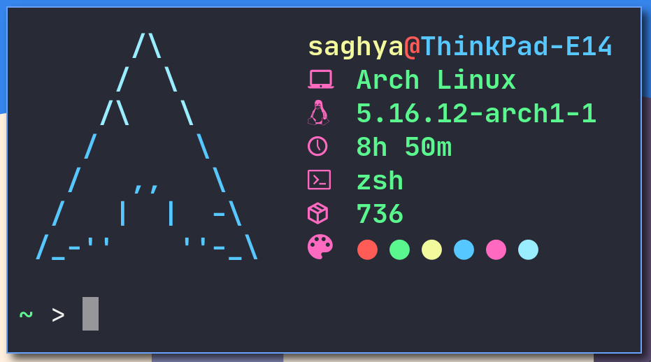

<h2 align="center"> afetch </h2>

<h3 align="center">  </h3>

Fast and simple system info (for UNIX based operating systems) written in POSIX compliant C99, that can be configured at compile time by editing the <a href="src/config.h">config.h</a> file. It uses the C Preprocessor to implement config options at compile time.    
afetch is a command line tool to display basic system information. The goal is to be highly configurable, extremely fast and work with no dependencies apart from the POSIX header files. 

**Requirements**
*  A `/etc/os-release` file
*  A C compiler
*  A <a href="https://en.wikipedia.org/wiki/C_POSIX_library">compatible C standard library</a> implementation

**Package count supported**

*  Alpine
*  Arch
*  ArchBang
*  Arco
*  Artix
*  Debian
*  DragonflyBSD
*  Elementary OS
*  EndeavourOS
*  Fedora (slow due to package manager)
*  FreeBSD
*  Gentoo
*  Parabola
*  Manjaro
*  NetBSD
*  NixOS
*  OpenBSD
*  OpenSUSE Leap (slow due to package manager)
*  OpenSUSE Tumbleweed (slow due to package manager)
*  Pop!_OS
*  Slackware
*  Solus
*  Ubuntu
*  Void
*  macOS (Homebrew)

If your OS isn't in the list above, you'll still be able to build and run the program as long as you're either using Linux, or another UNIX based operating system with the necessary header files.

**Please request your distro if you want it added**

If on Linux, please show me the contents of the `/etc/os-release` file.

**Manual**

I have provided a manual for configuration in the [afetch.1](src/afetch.1) file. You can view it by running `mandoc src/afetch.1 | less`, or `man afetch` if you've already ran `make install`.

**Configuration options**
*  Support for one custom shell command (replaces the package count)
*  Custom colours
*  Custom artwork
*  Edit headings for info rows
*  Force lowercase text (unstable)
*  Show path to shell
*  Select text colour
*  Colour blocks

**To do**
*  Optimise
*  Add support for more distros
*  Improve some logos by changing artwork and making it multicoloured

**Thanks**
*  All the [contributors](https://github.com/13-CF/afetch/graphs/contributors) <3

*  [neofetch](https://github.com/dylanaraps/neofetch)
*  [ufetch](https://github.com/jschx/ufetch)
*  [nerdfetch](https://github.com/ThatOneCalculator/NerdFetch)
*  [bitfetch](https://gitlab.com/bit9tream/bitfetch)

**A Disclaimer**

I'm not very good at using git, and this is my first project using the git CLI, so there'll be a stupid amount of commits, and other commits with very minor changes to one or two files.

