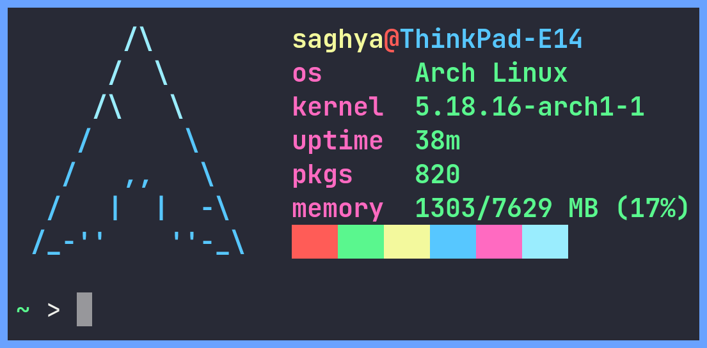

<h2 align="center"> afetch </h2>
<h4 align="center"> Simple system info </h4>

Fast and simple system info (for UNIX based operating systems) written in POSIX compliant C99, that can be configured at compile time by editing the <a href="src/config.h">config.h</a> file. It uses the C Preprocessor to implement config options at compile time.    

<h3> Why use afetch? </h3>
afetch is written in C99, meaning that it should be able to be compiled with almost all C compilers. As well as being written in a very fast language. The only bottleneck it has is the speed of your distros package manager! 

**Requirements**
*  `/etc/os-release` file for package count on Linux
*  A C compiler
*  A <a href="https://en.wikipedia.org/wiki/C_POSIX_library">compatible C standard library</a> implementation

**Configuration options**
*  Custom text for each seperate row of info
*  Option to print colour blocks, and choose a character for the block
*  More to be implemented soon

**To do**
*  Make README.md more dynamic (adapt to different screen sizes)

**Thanks**
*  All the [contributors](https://github.com/13-CF/afetch/graphs/contributors) <3

*  [neofetch](https://github.com/dylanaraps/neofetch)
*  [ufetch](https://github.com/jschx/ufetch)
*  [nerdfetch](https://github.com/ThatOneCalculator/NerdFetch)
*  [bitfetch](https://gitlab.com/bit9tream/bitfetch)
*  [pfetch](https://github.com/dylanaraps/pfetch)

